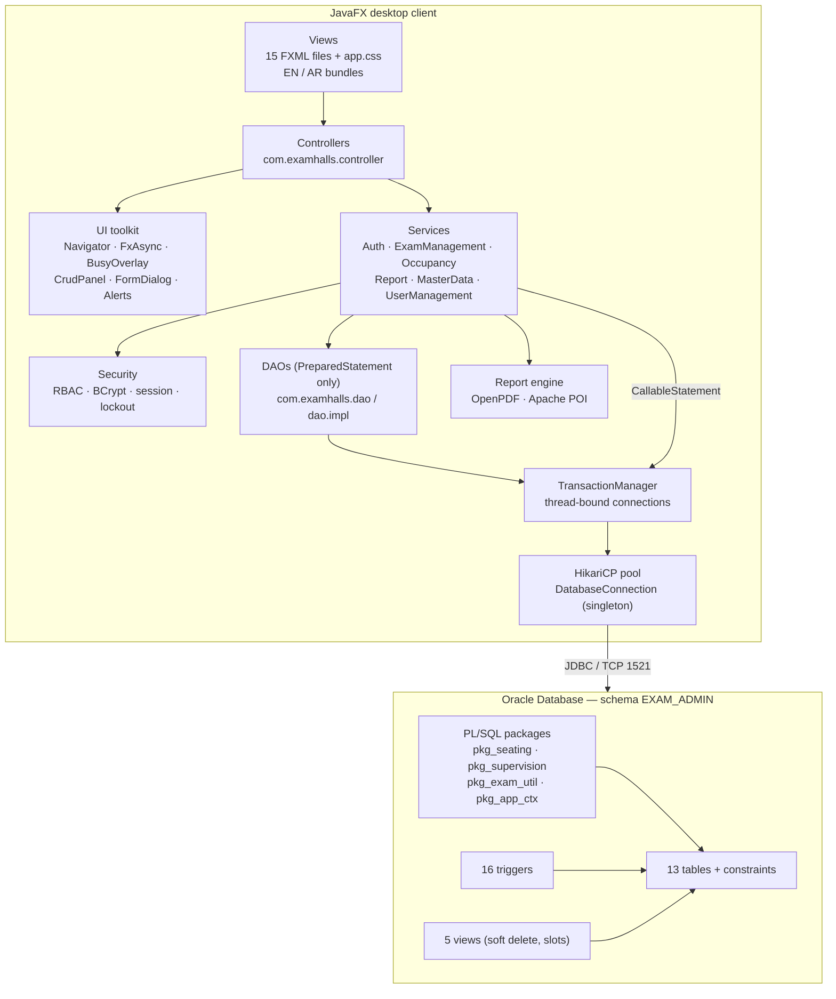
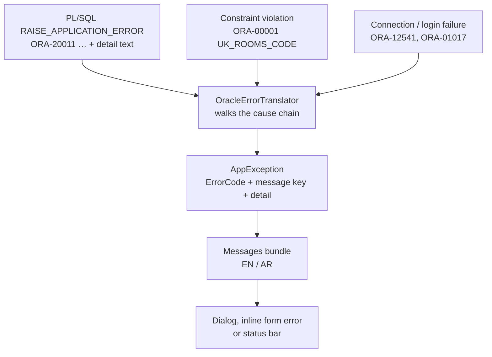
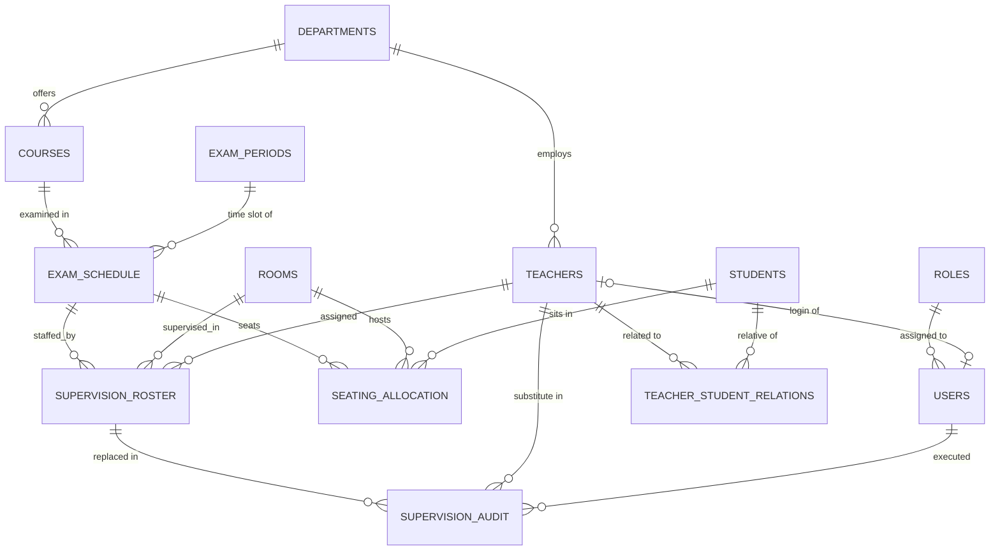
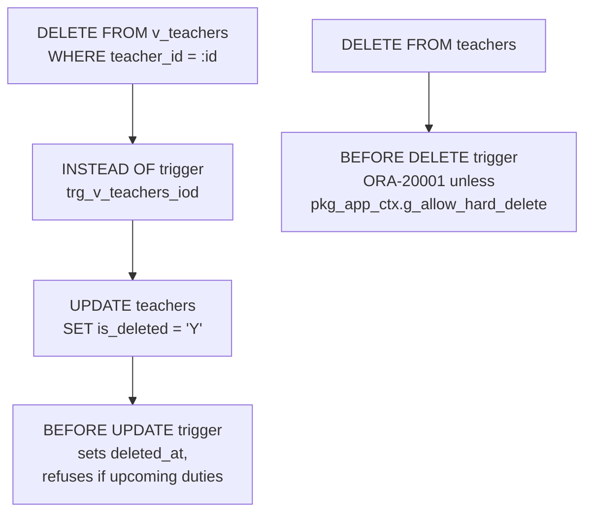
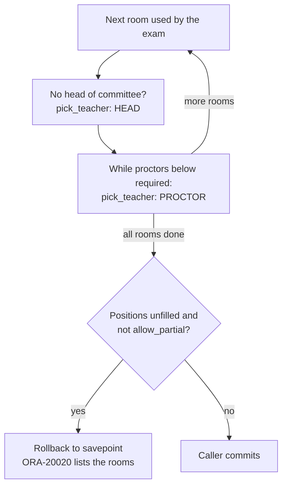
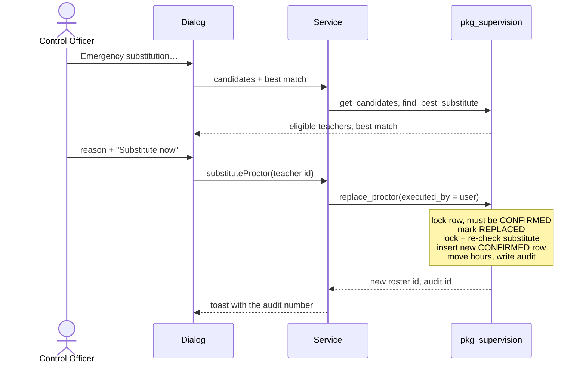
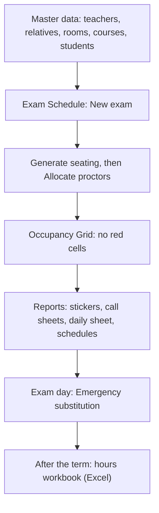

# Exam Halls & Proctoring Allocation Management System

**Technical documentation — graduation project, version 1.0.0**

JavaFX 21 desktop application · Oracle Database · PL/SQL business engine · English / Arabic (RTL)

---

## Table of contents

1. [Executive summary](#1-executive-summary)
2. [System architecture](#2-system-architecture)
3. [Database and business-logic engine](#3-database-and-business-logic-engine)
4. [Algorithms and fairness rules](#4-algorithms-and-fairness-rules)
5. [Role-based user guide](#5-role-based-user-guide)
6. [Deployment and setup guide](#6-deployment-and-setup-guide)
7. [Quality assurance](#7-quality-assurance)
8. [Known limitations and future work](#8-known-limitations-and-future-work)
9. [Appendix](#9-appendix)

---

## 1. Executive summary

### 1.1 Problem

Before every exam session a school's exam-control office must, by hand:

- seat hundreds of students in rooms whose exam capacity (with spacing) is lower than their normal capacity;
- assign a head of committee and enough proctors to every room;
- respect conflict-of-interest rules — a teacher may not supervise an exam of their own subject, nor any
  session in which a relative (up to the 4th degree) is sitting;
- spread the supervision load fairly and respect each teacher's daily and weekly limits;
- react within minutes when a proctor is absent on exam day, and keep a trace of every change;
- print desk stickers, call sheets, schedules and a compensation report.

Doing this on paper is slow and error-prone, and rule violations are only discovered on exam day.

### 1.2 Solution

A desktop application for the exam-control office in which **the rules live in the database**:

| Capability | How |
|---|---|
| Automated seating | `pkg_seating.generate_seating` — all students of the exam's grade, capacity-aware, special-needs students in front, room sharing between simultaneous exams |
| Fair proctor allocation | `pkg_supervision.allocate_proctors` — 1 head + 1 proctor per 20 students per room; least-loaded teacher first |
| Conflict-of-interest prevention | Subject conflict (per room), time conflict, daily / weekly caps, relatives (per session, any room) — checked for every assignment |
| Emergency 1-click substitution | `pkg_supervision.replace_proctor` — best eligible teacher, hours transferred, immutable audit record |
| Safety interlocks | Triggers refuse archiving teachers/rooms still in use, shrinking a room that has future seating, editing the audit log |
| Reports | Seating stickers, attendance call sheets, individual schedules, daily control sheet (PDF) and hours-for-compensation workbook (Excel) |
| Bilingual UI | Every screen, message and report in English and Arabic, right-to-left layout in Arabic |

### 1.3 Scope delivered

| Spec screen | Screen in the application | Roles |
|---|---|---|
| 1 | Login (+ Users & Roles management) | everyone / School Admin |
| 2 | Teachers & Staff (with relatives register) | Admin, Control Officer |
| 3 | Rooms & Halls | Admin, Control Officer |
| 4 | Seating & Supervision — seating plan | Admin, Control Officer (Committee Head read-only) |
| 5 | Exam Schedule (with exam creator/editor) | Admin, Control Officer (Committee Head read-only) |
| 6 | Seating & Supervision — supervision matrix | Admin, Control Officer (Committee Head read-only) |
| 7 | Emergency Substitution dialog | Admin, Control Officer |
| 8 | Occupancy Grid | Admin, Control Officer, Committee Head |
| 9 | Reports & Exports | Admin, Control Officer, Committee Head |
| — | Executive Dashboard (analytics & operations center), Courses & Departments, Students, My Duties | see §5 |

### 1.4 Key figures

| Item | Count |
|---|---|
| Database tables / views / triggers / PL/SQL packages | 13 / 5 / 16 / 4 |
| SQL + PL/SQL (scripts 00–05) | ~1,800 lines |
| Java source files / lines | 128 / ~9,800 |
| FXML views | 15 |
| Translated messages (EN = AR) | 468 each |
| Automated tests | 84 JUnit test cases (64 unit, 20 integration) + 25 SQL smoke checks |

---

## 2. System architecture

### 2.1 Technology stack

| Layer | Technology | Version | Why |
|---|---|---|---|
| Language / runtime | Java | 21 LTS (runs on 21+) | LTS on lab machines; records, switch expressions, text blocks |
| UI | JavaFX + FXML + CSS | 21.0.6 | Native desktop UI, declarative views, full RTL support |
| Database | Oracle Database | tested on Free 23.26 (26ai); scripts use 12c+ features | Required platform; PL/SQL keeps rules next to the data |
| JDBC driver | ojdbc11 | 23.6 | Oracle-certified for Java 11+ |
| Connection pool | HikariCP | 6.2.1 | Fast, small, production standard |
| Password hashing | at.favre.lib `bcrypt` | 0.10.2 | Adaptive hash, `$2a$` compatible |
| PDF | OpenPDF | 2.0.3 | LGPL/MPL fork of iText 2 with Arabic shaping and bidi |
| Excel | Apache POI (`poi-ooxml`) | 5.4.0 | `.xlsx` with formulas and RTL sheets |
| Logging | SLF4J + Logback | 2.0 / 1.5 | Console + rolling file `logs/examhalls.log` |
| Build | Maven (+ shade, assembly, javafx plugins) | 3.9 | One command to run, test and package |
| Tests | JUnit 5 | 5.11 | Unit + database integration tests |

### 2.2 Layered architecture



**Pattern: MVC with a service layer and DAOs.**

- **Model** — immutable Java `record`s (`Teacher`, `Room`, `ExamOverview`, `TeacherCandidate`, …) that mirror
  tables, views and procedure results; enums for every status column.
- **View** — FXML files for page structure, one shared stylesheet (`app.css`) with design tokens, and two
  resource bundles for all text.
- **Controller** — one per view; it binds records to controls and calls services on background threads.
  Controllers never touch JDBC.
- **Service layer** — enforces permissions, validates input, owns transactions and calls PL/SQL.
- **DAO layer** — plain SQL with `PreparedStatement`; no ORM, so the SQL shown in this document is exactly
  what runs.

MVVM was considered; JavaFX property bindings are used where they help (observable/filtered lists, selection
listeners), but full view-models would duplicate the records without adding value for a project of this size.

### 2.3 Package structure

```
com.examhalls
├── MainApp, Launcher  entry points (Launcher: also --check-db)
├── config      DatabaseConnection (HikariCP), TransactionManager,
│               AppSettings
├── security    RoleType, Permission, UserSession, PasswordHasher,
│               LoginAttemptTracker
├── model       records and enums
├── dao         interfaces
│   └── impl    JDBC implementations (JdbcSupport base class)
├── service     AuthService, ExamManagementService,
│               OccupancyService, ReportService, MasterDataService,
│               UserManagementService, DashboardService,
│               ServiceRegistry
├── report      PdfKit, PdfReports, HoursWorkbook, ReportFonts
├── exception   AppException, ErrorCode, OracleErrorTranslator
├── ui          Navigator, View, FxAsync, BusyOverlay, Alerts,
│               Exports, CrudPanel, FormDialog
├── controller  one controller per screen / dialog
└── util        Messages (i18n), Formats (locale-aware formatting)

resources/  application.properties, logback.xml, view/*.fxml,
            css/app.css, i18n/messages[_ar].properties
```

### 2.4 Connection pooling (HikariCP)

`DatabaseConnection` is a **thread-safe, lazily created singleton** (volatile field + double-checked
locking). Unlike the "holder class" idiom, a failed start (database down) can be retried on the next call.

| Setting | Value | Reason |
|---|---|---|
| `maximumPoolSize` / `minimumIdle` | 10 / 2 | Desktop client: few concurrent statements |
| `connectionTimeout` | 5 s | Snappy failure in the UI |
| `oracle.net.CONNECT_TIMEOUT` | 4 s | Driver gives up before the pool, so the real ORA- error is reported |
| `initializationFailTimeout` | 1 ms (one attempt) | Fail fast; **never** retry a wrong password in the background — Oracle's default profile locks an account after 10 failed logins |
| `maxLifetime` / `idleTimeout` | 30 min / 10 min | Below typical firewall idle cut-offs |
| Statement cache / row prefetch | 50 / 50 | Oracle driver tuning |
| `v$session.program` | `ExamHallsApp` | DBAs can identify the sessions |

**Externalised configuration**, later sources override earlier ones:

1. `application.properties` inside the jar (defaults, **no password**)
2. `config/application.properties` next to the application, or `-Dapp.config=<file>`
3. environment variables `DB_URL`, `DB_USERNAME`, `DB_PASSWORD`
4. JVM system properties, e.g. `-Ddb.password=…`

**Transactions.** `TransactionManager` binds a connection to the current thread. DAOs call
`tx.connection()`: inside `inTransaction(...)` they share the transaction's connection; outside they borrow
an auto-commit connection. `runAndRollback(...)` executes real work and discards it — used by all
integration tests.

### 2.5 Threading model

All database work runs off the JavaFX Application Thread through `FxAsync.run(work, onSuccess, onError,
always)`. A `BusyOverlay` (a reference-counted spinner) covers the view and blocks input while a
procedure runs, so the window never freezes and nobody double-clicks "Allocate".

### 2.6 Error-handling pipeline



- **Application errors** (-20001 … -20030) map to `ErrorCode`s, and the PL/SQL text with its numbers
  (e.g. "300 students, only 248 free seats") is kept as secondary detail.
- **Constraint errors** carry the constraint name, so the user sees a specific sentence such as "A room with
  this code already exists". Foreign keys have two keys, `constraint.FK_x` (parent missing) and
  `constraint.child.FK_x` (still referenced).
- **Login errors** (ORA-01017, 28000, 28001) are reported as "account rejected", not "network down".
- A unit test ensures every key exists in both English and Arabic.

### 2.7 Security

| Measure | Implementation |
|---|---|
| Password storage | BCrypt cost 12 (`$2a$`), CHECK constraint on `USERS.PASSWORD_HASH` format |
| No user enumeration | Unknown username and wrong password give the same message **and** take the same time (a dummy BCrypt verification runs for unknown users) |
| Input validation | One `CredentialPolicy` for client and server. Usernames must match `^[A-Za-z0-9._-]{3,50}$` (no spaces, quotes, SQL or control characters). The login screen caps the fields while typing (50 / 128 characters) and rejects a malformed username at once; `AuthService` repeats every check **before any database access**. Malformed input costs the same time as a wrong password and counts as a failed attempt |
| Whitespace | Leading/trailing whitespace around the username is removed with `strip()` (Unicode whitespace only, so a hidden control character is rejected rather than silently removed). Passwords are never trimmed: spaces are valid password characters |
| BCrypt 72-byte limit | BCrypt uses only the first 72 bytes and the library throws above that. Sign-in rejects anything over 72 UTF-8 bytes as invalid credentials, and new passwords are limited to 64 characters / 72 bytes |
| Brute force | 5 consecutive failures lock the username for 5 minutes, even for the correct password. A partial run of failures is forgotten after 5 quiet minutes and expired entries are pruned. In memory, per application instance; both numbers are configurable (§6.3) |
| Password policy | 8–64 characters with letters and digits. Passwords are changed through the School Admin's **Reset password** dialog on the Users & Roles screen. A self-service change exists in the service layer (`AuthService.changePassword`, same policy) but has no screen yet (§8) |
| Secrets in memory | Passwords handled as `char[]` and wiped after hashing/verifying (the JavaFX password field itself keeps a `String` while the screen is open, a platform limitation) |
| Session | See §2.7.1: in-memory session, cleared on sign-out and after 15 minutes of inactivity |
| Log injection | Usernames are sanitised (control characters replaced, length capped) before they reach the log |
| RBAC | `RoleType` → `Permission` matrix (§5.1). Every service method calls `session.require(permission)`; the UI additionally hides what a role cannot do |
| Accountability | `SUPERVISION_AUDIT.EXECUTED_BY` is taken from the server-side session, and its timestamp is set by a trigger, never by the client |
| SQL injection | `PreparedStatement` / `CallableStatement` with bind variables everywhere |
| Least privilege (DB) | Application schema user with only `CREATE SESSION, TABLE, VIEW, PROCEDURE, TRIGGER, SEQUENCE` |
| Configuration | The shipped jar contains no password (a unit test checks this); credentials live in a git-ignored file or environment variables |

#### 2.7.1 Session model: why there is no JWT

- **What exists.** After a successful sign-in `AuthService` stores an immutable `AuthenticatedUser` (id,
  username, full name, role, linked teacher, sign-in time; never the password hash) in the `UserSession`
  singleton, an `AtomicReference` so background tasks read the same value as the UI thread. It lives
  only in the memory of the running JVM: nothing is written to disk, the registry or a cookie, and closing
  the application ends the session.
- **Why no token.** A token such as a JWT is a signed claim that a *server* checks on every request.
  This is a two-tier desktop application: the services and the session run in the same process, so there
  is no second party to present a token to. A JWT here would add a signing key to protect and a token to
  store, and would protect nothing.
- **If a middle tier is added** (REST API for a web or mobile client), the right design is a short-lived
  access token (about 15 minutes) kept in memory only, plus a rotating refresh token kept server-side or
  in the operating-system credential store (Windows Credential Manager, macOS Keychain), never in a
  plain file. The API would then enforce RBAC with the token's claims.
- **Clean end of session.** Sign-out and the idle timeout (`security.session.idleTimeoutMinutes`,
  default 15, 0 = off) go through the same path: every open dialog and popup is closed, `logout()` sets
  the session to empty, the shell stops its timer and detaches its listeners, and the sign-in screen is
  shown (after a timeout with a notice explaining why). Any later service call fails with
  `NOT_AUTHENTICATED`. Keyboard, mouse and scroll input in any window of the application counts as
  activity.
- **Known boundary.** RBAC is enforced in the Java service layer, and all clients connect with one schema
  account. Someone who has the configuration password could bypass RBAC with SQL*Plus, although every
  business rule still holds because it lives in PL/SQL, constraints and triggers. Closing that gap needs
  per-user database identities (Oracle proxy authentication or secure application roles) or a middle
  tier that alone holds the credentials.

### 2.8 Internationalisation and right-to-left

- **Text.** Two UTF-8 bundles hold all text; FXML uses `%key`, code uses `Messages.get(key, args)`. The
  language is chosen on the login screen, or switched from the top bar without signing out (the frame is
  rebuilt on the same page), and remembered per OS user (Java Preferences).
- **Layout.** In Arabic the scene root gets `NodeOrientation.RIGHT_TO_LEFT`, which mirrors all layout,
  tables and dialogs.
- **Fonts.** Arabic uses Tahoma or Geeza Pro, because JavaFX's fallback font drops spaces between Arabic
  words and digits.
- **Numbers.** Arabic dates use Arabic-Indic digits. Times and fractions are written without spaces
  (`09:00-11:00`, `16/24`) so the bidi algorithm keeps them as one left-to-right run, in the UI and in PDFs.
- **Reports.** PDFs are built entirely from RTL table cells (OpenPDF only shapes Arabic there). Excel sheets
  are set right-to-left.

### 2.9 Design system and light / dark themes

The UI follows the **Graphite Shell** design system: warm graphite surfaces, bone-coloured text, one muted
sage accent (`#9cb380`) reserved for the primary action, the active page and the highlighted chart
value, 3 / 5 / 8 px radii, and Inter for prose with JetBrains Mono for buttons, labels and figures
(compact density, 13 px, for a data-heavy desktop app).

- **Tokens.** All colours in `app.css` are named tokens (`-gs-shell`, `-gs-pane`, `-gs-ink`, `-gs-accent`
  and so on). Controls, popups and charts are styled only through them, including JavaFX's own base
  colours, so built-in controls such as date pickers and scroll bars follow the theme too.
- **Two themes.** Dark is the system's native look and the default. The light theme is the same system
  inverted (bone background, graphite text); it only redefines the tokens on `.root.theme-light`.
  Accent-coloured and status text is darkened there to keep WCAG AA contrast.
- **Switching.** Use the **Dark / Light** switch on the login screen, or the **Light mode / Dark mode**
  button in the top bar. `ui/Theme` toggles one style class on the root of every open window, including
  dialogs and popups, so the change is instant and nothing reloads. The choice is remembered per OS user.
- **Status colours.** Besides sage, only the red and amber of the staffing alerts are used (red
  `#EF4444`, the system's input-error colour, and a muted amber).
- **Fonts.** At start-up `ui/AppFonts` registers the Inter and JetBrains Mono TTF files (SIL Open Font
  License) placed in `resources/com/examhalls/fonts`, so lab PCs need nothing installed. The files are not
  in the repository yet; until they are added, JavaFX uses the system font. Arabic keeps Tahoma (see 2.8).

---

## 3. Database and business-logic engine

The schema (owner `EXAM_ADMIN`) has 13 tables in four groups:

| Group | Tables | Changes |
|---|---|---|
| Security | `ROLES`, `USERS` | rarely; School Admin only |
| Organisation | `DEPARTMENTS`, `TEACHERS`, `COURSES`, `STUDENTS`, `TEACHER_STUDENT_RELATIONS` | master data, maintained before each term |
| Infrastructure | `ROOMS`, `EXAM_PERIODS` | master data |
| Operations | `EXAM_SCHEDULE`, `SEATING_ALLOCATION`, `SUPERVISION_ROSTER`, `SUPERVISION_AUDIT` | written by the PL/SQL engine during exam preparation and on exam day |

Only the operations group is written by the business-logic engine; the other groups are plain master data
behind validation, constraints and triggers.

### 3.1 Entity–relationship model

Tables and relationships (columns and constraints are listed in §3.2).



### 3.2 Table catalogue

All primary keys are `GENERATED BY DEFAULT ON NULL AS IDENTITY`. Every constraint is named, so errors can be
translated precisely.

| # | Table | Purpose | Notable rules |
|---|---|---|---|
| 1 | `ROLES` | `SCHOOL_ADMIN`, `CONTROL_OFFICER`, `COMMITTEE_HEAD`, `TEACHER` | names match the Java `RoleType` enum |
| 2 | `USERS` | Logins | BCrypt format CHECK; soft delete; optional unique `TEACHER_ID` |
| 3 | `DEPARTMENTS` | Academic departments | drive the subject-conflict rule |
| 4 | `TEACHERS` | Proctor pool | `MAX_WEEKLY_LOAD ≥ MAX_DAILY_LOAD`, daily 0–10, `HOURS_BALANCE ≥ 0`; soft delete |
| 5 | `COURSES` | Course → department + grade level | unique code |
| 6 | `ROOMS` | Halls | `0 < EXAM_CAPACITY ≤ REGULAR_CAPACITY`; status `AVAILABLE / MAINTENANCE / UNAVAILABLE` (shown as "Suspended"); soft delete |
| 7 | `EXAM_PERIODS` | Time-of-day templates ("First Period" 09:00–11:00) | only the time part of the DATEs is used |
| 8 | `EXAM_SCHEDULE` | An exam = course + date + period | one exam per course per day; date without time |
| 9 | `STUDENTS` | Roster | grade level, section, `HAS_SPECIAL_NEEDS` |
| 10 | `SEATING_ALLOCATION` | Student → room/seat for an exam | one seat per student per exam; unique seat per exam+room; attendance status; cascade-deleted with its exam |
| 11 | `SUPERVISION_ROSTER` | Teacher → room for an exam, role head/proctor | status `CONFIRMED / REPLACED / CANCELLED`; function-based unique indexes: one *active* assignment per teacher per exam, one *active* head per exam+room |
| 12 | `SUPERVISION_AUDIT` | Emergency substitution log | append-only (trigger), server timestamp |
| 13 | `TEACHER_STUDENT_RELATIONS` | Kinship, degree 1–4 | unique teacher+student pair |

**Schema extensions agreed during development** (on top of the original 13-table specification):

| Extension | Reason |
|---|---|
| `UPDATED_AT`, `DELETED_AT` on `USERS`, `TEACHERS`, `ROOMS` | Audit timestamps maintained by triggers |
| `USERS.TEACHER_ID` (nullable, unique, FK) | Teacher and Committee Head logins see their own duties |
| `STUDENTS.SECTION` (nullable) | Class section shown and edited in the student roster |

**Views.**

| View | Purpose |
|---|---|
| `V_USERS`, `V_TEACHERS`, `V_ROOMS` | Active rows only. The DAOs read from these and delete through them |
| `V_EXAM_SLOTS` | Every exam with its real `SLOT_START` / `SLOT_END` (exam date + period time) and duration in hours; the basis of all overlap logic |
| `V_SUPERVISION_ROSTER` | Active roster with names, for reports |

### 3.3 Soft delete

Oracle cannot turn a `DELETE` on a *table* into an `UPDATE`. The design therefore uses views:



- **Restoring a row** is `UPDATE … SET is_deleted = 'N'`; the trigger clears `DELETED_AT`.
- **History survives archiving.** Archived teachers still appear in historical reports: the compensation
  report reads the base table, because an archived teacher must still be paid for work done.

### 3.4 Triggers (16)

| Trigger | Event | Effect |
|---|---|---|
| `trg_users_bi` / `_bu` | insert / update | trim username; `CREATED_AT` immutable; `UPDATED_AT`, `DELETED_AT` |
| `trg_users_bd`, `trg_teachers_bd`, `trg_rooms_bd` | delete on base table | block hard delete (ORA-20001) |
| `trg_v_users_iod`, `trg_v_teachers_iod`, `trg_v_rooms_iod` | INSTEAD OF delete on view | soft delete |
| `trg_teachers_bi` / `_bu` | insert / update | upper-case code; refuse archiving with upcoming CONFIRMED duties (ORA-20002) |
| `trg_rooms_bi` / `_bu` | insert / update | upper-case code; refuse archiving, leaving AVAILABLE, or shrinking exam capacity while future exams use the room (ORA-20002) |
| `trg_seating_biu` | insert / room change | seat only in active AVAILABLE rooms (ORA-20004) |
| `trg_roster_biu` | insert / teacher or room change | assign only active teachers to usable rooms (ORA-20005 / 20004) |
| `trg_audit_bi` | insert | `AUDIT_TIMESTAMP := SYSTIMESTAMP` (client value ignored) |
| `trg_audit_bud` | update / delete | audit is append-only (ORA-20003) |

### 3.5 Audit logging

The audit trail has three layers:

1. **`SUPERVISION_AUDIT`.** Every emergency substitution records the original roster row (which keeps the
   replaced teacher), the substitute, the executing user, the reason and a server timestamp. Rows cannot be
   updated or deleted.
2. **Roster history.** Replaced rows stay in `SUPERVISION_ROSTER` with status `REPLACED`, and cancelled
   allocations with `CANCELLED`. Nothing is overwritten.
3. **Application log** (`logs/examhalls.log`, rolling daily, 14 days). It records who signed in, generated
   seating, allocated, substituted, exported, and created or edited master data.

### 3.6 PL/SQL packages

| Package | Routine | Contract |
|---|---|---|
| `pkg_app_ctx` (spec only) | error-code constants, `g_allow_hard_delete` | shared by triggers and packages |
| `pkg_exam_util` | `get_slot(exam_id)` | the exam's date, real start/end, duration, course department, grade |
| `pkg_seating` | `generate_seating(exam_id, OUT seated, OUT rooms_used)` | §4.2 |
| | `clear_seating(exam_id)` | refused while proctors are allocated |
| | `mark_attendance(seating_id, status)` | `PRESENT / ABSENT / EXCUSED / ABSENT_PENDING` |
| `pkg_supervision` | `check_eligibility(teacher, exam, room) → NULL or 'CODE: reason'` | §4.4 |
| | `allocate_proctors(exam, OUT assigned, OUT unfilled, students_per_proctor = 20, allow_partial = 'N')` | §4.3 |
| | `cancel_allocation(exam, OUT cancelled)` | releases staff and refunds hours |
| | `find_best_substitute(roster_id) → teacher_id` | read-only preview |
| | `replace_proctor(roster_id, executed_by, reason, IN OUT substitute_id, OUT new_roster_id, OUT audit_id)` | §4.5 |
| | `get_candidates(exam, room) → SYS_REFCURSOR` | every active teacher with an eligibility column |

**Transaction contract.** Procedures never `COMMIT`. Each sets a `SAVEPOINT` and rolls back to it on any
error, so a failed call leaves no partial work. The Java service decides when to commit, and calls use named
notation (`p_exam_id => ?`) so a reordered package spec cannot break them.

**Concurrency.**

- **Seating:** locks the exam row and its period row (`FOR UPDATE WAIT 10`), so two users cannot grab the
  same free seats.
- **Allocation:** picks a teacher, locks the teacher row, then **re-checks** eligibility before inserting
  ("pick, lock, re-check"), because another session may have assigned the same teacher meanwhile.
- **Last line of defence:** the function-based unique indexes on the roster.

### 3.7 Application error codes

| Code | Name | Raised when |
|---|---|---|
| -20001 | HARD_DELETE_BLOCKED | `DELETE` on USERS / TEACHERS / ROOMS base table |
| -20002 | HAS_FUTURE_DUTIES | archiving a busy teacher, or taking a room in use out of service |
| -20003 | AUDIT_IMMUTABLE | updating/deleting `SUPERVISION_AUDIT` |
| -20004 | ROOM_NOT_USABLE | seating/assigning in a room that is not AVAILABLE |
| -20005 | TEACHER_NOT_ACTIVE | assigning an archived teacher |
| -20010 | NOT_FOUND | unknown exam / roster row / user |
| -20011 | INSUFFICIENT_CAPACITY | students do not fit into the free seats of the slot |
| -20012 | STUDENT_CLASH | students already seated in an overlapping exam |
| -20013 | NO_STUDENTS | no students in the course's grade level |
| -20020 | NO_ELIGIBLE_TEACHER | allocation or substitution cannot fill a position |
| -20021 | TEACHER_INELIGIBLE | chosen substitute violates a rule |
| -20022 | INVALID_STATE | e.g. re-seating a staffed exam, replacing a non-CONFIRMED row |
| -20030 | INVALID_ARGUMENT | bad parameter (e.g. empty reason) |

---

## 4. Algorithms and fairness rules

### 4.1 Time model

An exam's real slot is `EXAM_DATE + time-of-day(PERIOD)`. Two exams **overlap** when

```
a.slot_start < b.slot_end  AND  b.slot_start < a.slot_end
```

Every rule (room capacity, student clashes, teacher availability, relatives) uses this test rather than
"same period id", so it stays correct if periods are redefined or several exams share a slot.

### 4.2 Seating generator (`pkg_seating.generate_seating`)

```
1  lock the exam row and its period row
2  refuse if the exam has active proctors
      (cancel the allocation first)
3  delete the exam's existing seating (safe to regenerate)
4  S := students of the course's grade level,
      ordered by has_special_needs DESC, student_code
5  refuse if any of S sits an overlapping exam
      (STUDENT_CLASH)
6  refuse if a teacher already supervising the slot
      is related to any of S
7  R := active AVAILABLE rooms with free seats > 0, where
      free = exam_capacity - seats used by overlapping exams
      ordered by free DESC, room_code   (largest first)
8  for each room r in R while students remain:
      take min(free(r), remaining) students
      number seats after the highest seat already used
      in r during the slot ("001", "002", ...)
9  if students remain: rollback, INSUFFICIENT_CAPACITY
      (all-or-nothing)
10 bulk insert (FORALL)
```

- **Largest rooms first** minimise the number of rooms, and so the number of proctors needed.
- **Special-needs students first** get the lowest seat numbers, i.e. the front rows of the largest room.
- **Room sharing.** A second exam in the same slot uses the remaining capacity of partly filled rooms, and
  its seat numbers continue after the first exam's, so a physical seat is never double-booked.
- **Cost:** after sorting, the work is linear in students + rooms, with a single bulk insert.

*Seed example (10 Jan 2027, First Period).* MATH-10 (70 students) is seated in HALL-1 (60) and B101 (10).
CHEM-11 (70 students, same slot) then takes the rooms with the most free seats left: B102 (30), A101 (24)
and A102 (16). With less capacity it would continue into B101's 20 remaining seats, numbering them 011
onwards.

### 4.3 Fair proctor allocation (`pkg_supervision.allocate_proctors`)

**Staffing rule, per room used by the exam:**

```
students_in_room = students seated in the room during the slot
                   (all exams sharing the room)
heads_needed     = 1
proctors_needed  = max(1, ceil(students_in_room / 20))
missing          = needed − staff already in the room during the slot
```

Staff attached to another exam that shares the room are counted, so a shared room is never double-staffed.

**Fairness rule.** Each open position is given to the first eligible teacher in this order:

```sql
ORDER BY hours_balance ASC,            -- least supervision hours
         active CONFIRMED duties ASC,  -- then fewest current duties
         teacher_id                    -- deterministic tie-break
```

`HOURS_BALANCE` grows by the slot's duration on each assignment, decreases on cancellation, and moves from
the replaced teacher to the substitute. The ordering is re-evaluated after every single assignment inside
the same transaction, so load spreads evenly across the whole day and week.

`pick_teacher` walks the candidates in that order and takes the first one for which
`check_eligibility` returns no reason. It then locks that teacher's row, re-checks, inserts the CONFIRMED
roster row and adds the slot duration to `HOURS_BALANCE`.



### 4.4 Conflict-of-interest and eligibility rules (`check_eligibility`)

The checks run in this order; the first failing one is returned as `CODE: explanation` and shown translated
in the UI.

| # | Code | Rule | Scope |
|---|---|---|---|
| 0 | `NOT_FOUND` / `TEACHER_INACTIVE` | teacher exists and is not archived | — |
| 1 | `SUBJECT_CONFLICT` | the teacher's department equals the department of the exam's course, or of any other course seated in the same room during the slot | **per room**: a Chemistry teacher may supervise a Maths-only room during a shared slot |
| 2 | `TIME_CONFLICT` | already supervising an overlapping slot | teacher |
| 3 | `DAILY_LIMIT` | confirmed sessions that day ≥ `MAX_DAILY_LOAD` | teacher, day |
| 4 | `WEEKLY_LIMIT` | confirmed sessions in that ISO week ≥ `MAX_WEEKLY_LOAD` | teacher, Monday-based week |
| 5 | `RELATIVE_IN_SESSION` | a relative (degree 1–4) sits **any** exam, in **any** room, during an overlapping slot — or belongs to the grade of this exam (even before it is seated) | **whole session** (strict exam-control standard) |

The relatives rule is also enforced in the other direction:

- **Seating** refuses to seat a grade when a teacher already supervising that slot is related to one of its
  students.
- **Recording a new relation** reports how many of the teacher's upcoming duties now conflict, so the Control
  Officer can substitute them.

### 4.5 Emergency 1-click substitution



- **What you see is what is assigned.** The dialog sends the *explicit* id of the teacher it displayed. If
  that teacher became ineligible in the meantime, the call fails with a clear reason instead of silently
  picking someone else.
- **"Best match"** uses the same fairness ordering as allocation, excluding the replaced teacher.
- **Manual choice.** The candidate list shows only eligible teachers; a toggle shows everyone with the
  translated reason they are blocked.

### 4.6 Under-staffing detection (Occupancy Grid, daily control sheet)

For every room × period of a day:

```
EMPTY         no seated students, room AVAILABLE
UNAVAILABLE   room under maintenance / suspended, empty
UNDERSTAFFED  seated > 0 and (no head, or
              proctors < max(1, ceil(seated / 20)))
STAFFED       otherwise

missing = (no head ? 1 : 0)
        + max(0, required proctors - proctors)
```

### 4.7 Dashboard metrics

The Executive Dashboard reads everything with six read-only queries (exam overview, rooms, seats, roster,
department workload, audit feed) and computes the figures in memory for all exams from today on.
Staffing is measured per **room session** (room + day + period), the same unit the allocation engine
uses, because exams sharing a room share its staff.

```
required(session) = 1 head + max(1, ceil(seated / 20))
filled(session)   = min(1, heads) + min(proctors, required proctors)
coverage          = sum(filled) / sum(required)
capacity(day)     = sum(exam capacity of AVAILABLE rooms)
                    x periods used that day
red alert         = seated session with nobody on duty
amber alert       = seated session partly staffed
```

Each exam gets a state for the donut chart: **awaiting seating** (nothing seated), **unassigned**
(seated, nobody on duty in any of its rooms), **partially staffed** or **fully staffed**. The focus day
is today when it has exams, otherwise the next exam day. It drives the exam table, the teachers-on-duty
figure and the quick actions. The substitution feed is shown only to roles with `VIEW_AUDIT`.

### 4.8 Compensation hours

The Excel report sums the duration of **CONFIRMED** duties in the chosen date range. A substitute is paid
for the session; the replaced teacher is not. The hourly rate is an editable cell (default from
`reports.compensation.hourlyRate`), and the amount and total columns are live Excel formulas.

---

## 5. Role-based user guide

### 5.1 Permission matrix

| Permission | School Admin | Control Officer | Committee Head | Teacher |
|---|:-:|:-:|:-:|:-:|
| Manage users & roles | ✔ | | | |
| Manage master data (teachers, rooms, courses, students, exam schedule) | ✔ | ✔ | | |
| Generate seating | ✔ | ✔ | | |
| Allocate / cancel proctors | ✔ | ✔ | | |
| Emergency substitution | ✔ | ✔ | | |
| View all schedules, grid, seating & supervision | ✔ | ✔ | ✔ | |
| Reports & exports | ✔ | ✔ | ✔ | own schedule only |
| View audit trail | ✔ | ✔ | | |
| View own duties | ✔ | ✔ | ✔ | ✔ |

Landing page after sign-in: Admin and Control Officer → Exam Schedule; Committee Head → Dashboard;
Teacher → My Duties. The sidebar only lists pages the role may open, and the services re-check every
permission.

### 5.2 Seed accounts (change the passwords after the first sign-in)

| Username | Password | Role | Linked teacher |
|---|---|---|---|
| `admin` | `Admin@2026` | School Admin | — |
| `control` | `Control@2026` | Control Officer | — |
| `head` | `Head@2026` | Committee Head | T-PHYS-01 Omar Tarek Mansour |
| `teacher` | `Teacher@2026` | Teacher | T-ENGL-01 Sarah Kamal Wahba |

### 5.3 Common to everyone

- **Sign-in.** Enter username and password. The **English / العربية** switch under the button changes
  the language for every screen and report, and the choice is remembered.
- **Status bar.** Shows whether the database is reachable. Successful actions show a green confirmation in
  the top bar, and errors explain what to do, in the current language.
- **Language and theme.** The two buttons on the right of the top bar switch English / العربية and
  light / dark mode at any time, without signing out. Both choices are remembered.
- **Sign out.** Bottom of the sidebar. After 15 minutes without keyboard or mouse activity the
  application signs out by itself, closes any open dialog and explains why on the sign-in screen.
- **Dashboard** (Admin, Control Officer, Committee Head). Five KPI cards: active exams, seated
  students vs hall capacity, proctoring coverage, under-staffed rooms (red/amber) and teachers on duty.
  Three charts: capacity vs seated per exam day (click a day to open its Occupancy Grid), proctor
  allocation status and department workload. Below them, the exams of the focus day with their staffing
  status (double-click to open one), quick actions (Seating & Supervision, Occupancy Grid, daily control
  sheet PDF) and the latest emergency substitutions. Hover over a card or bar for the exact definition
  and figures; **Refresh** reloads everything.

### 5.4 School Admin

1. **Users & Roles.** Create accounts (username 3–50 characters, strong password), assign the role, and
   link Teacher / Committee Head accounts to their teacher record (required for Teacher). Other actions:
   - reset a password (**Reset password** sets a new one under the same policy; this is currently the only
     way to change a password, as there is no self-service screen yet, see §8);
   - delete (archive) an account, which keeps its history.

   The system refuses to delete your own account or to remove the last School Admin.
2. Everything the Control Officer can do (below).

### 5.5 Control Officer — preparing an exam session



1. **Master data** (Management section of the sidebar):
   - **Teachers & Staff:** employee code, name, department (drives the subject rule), daily and weekly caps;
     the hours balance is read-only. Select a teacher to see and record **relatives** (degree 1–4).
     Archiving is refused while the teacher has upcoming duties.
   - **Rooms & Halls:** regular vs exam capacity (the table shows the spacing ratio) and status. Suspending
     a room, shrinking its capacity or archiving it is refused while upcoming exams use it.
   - **Courses & Departments:** each course belongs to a department and a grade level.
   - **Students:** search, filter by grade or "special needs only", edit section and special-needs flag.
2. **Exam Schedule → New exam:** course, period, date, notes (e.g. "Calculators not allowed"). A course can
   be examined once per day. A seated exam can only have its notes edited until its seating is cleared.
3. **Select the exam → Generate seating.** The status becomes **Seated**. Schedule every exam of a time
   slot before allocating, so shared rooms and relatives are handled correctly.
4. **Allocate proctors.** The status becomes **Staffed**. If a position cannot be filled, nothing is saved
   and the message lists the rooms concerned.
5. **Seating & Supervision** (Open, or double-click the exam):
   - the supervision matrix shows each room's occupancy, head of committee and proctors;
   - the lower tabs show the room's staff and seating plan;
   - **Cancel allocation** releases the staff and refunds their hours.
6. **Occupancy Grid:** check the day. Red cells are under-staffed; click a cell to open that exam.
7. **Reports & Exports:** seating stickers and attendance sheets per exam, the daily control sheet per day,
   and individual schedules (one teacher or all). Files open automatically after saving.
8. **Exam day — a proctor is absent:**
   1. Open Seating & Supervision, select the room and the staff row, then **Emergency substitution…**.
   2. Check the best match, choose or type a reason, and click **Substitute now** (or pick another eligible
      teacher).
   3. The change and the audit record are saved immediately.
9. **After the term:** Reports → *Proctoring hours for compensation* (Excel); enter the hourly rate in the
   yellow cell.

### 5.6 Committee Head

- **Dashboard:** your landing page: KPIs, charts, the exams of the day and quick actions (the
  substitution feed is reserved for the control office).
- **Exam Schedule / Occupancy Grid / Seating & Supervision:** read-only; see the rooms, students and staff
  of every session.
- **Reports:** print the attendance call sheet for your room and the daily control sheet for signatures.
- **My Duties:** your own upcoming duties, with **Download PDF**.

### 5.7 Teacher

- **My Duties:** date, period, course, room and role of every upcoming supervision.
- **Download PDF:** your individual proctoring schedule. Teachers can only export their own schedule.

---

## 6. Deployment and setup guide

### 6.1 Requirements

| Component | Requirement |
|---|---|
| Client PC | Windows 10/11 x64, Linux x64 or macOS; 1280×720 or larger screen. **Portable Windows edition: nothing to install.** Other bundles: Java 21 or newer (e.g. Eclipse Temurin 21) |
| Database | Oracle Database 19c or newer, **or** Docker Desktop to run Oracle Database Free (≈ 2 GB RAM, 1.5 GB download) |
| Build machine (only to build from source) | JDK 21+, Maven 3.9+ |
| Fonts for Arabic PDFs | Tahoma or Arial (present on Windows and macOS); on Linux DejaVu Sans or Noto Sans Arabic |

### 6.2 Oracle Database Free in Docker

```bash
docker run -d --name examhalls-oracle -p 1521:1521 \
  -e ORACLE_PASSWORD=<sys-password> \
  -e APP_USER=EXAM_ADMIN -e APP_USER_PASSWORD=<app-password> \
  -v examhalls-oradata:/opt/oracle/oradata \
  gvenzl/oracle-free:23-slim

# wait until the log says: DATABASE IS READY TO USE!
docker logs -f examhalls-oracle
```

The image creates the `EXAM_ADMIN` schema in the pluggable database `FREEPDB1`. Data persists in the
`examhalls-oradata` volume. After a reboot, run `docker start examhalls-oracle`.

**Install schema, packages and seed data** (drops and recreates all application objects, then runs the
smoke test):

```bash
# macOS / Linux
APP_USER_PASSWORD=<app-password> database/install-docker.sh
```
```bat
rem Windows
set APP_USER_PASSWORD=<app-password>
database\install-docker.bat
```

**Existing Oracle server instead of Docker.** A DBA creates the user (see `database/README.md`); then run
`database/install.sql` from that folder with SQL*Plus, SQLcl or SQL Developer (*Run Script*, F5):

```sql
CREATE USER exam_admin IDENTIFIED BY "<password>"
       QUOTA UNLIMITED ON users;
GRANT CREATE SESSION, CREATE TABLE, CREATE VIEW,
      CREATE PROCEDURE, CREATE TRIGGER, CREATE SEQUENCE TO exam_admin;
```

### 6.3 Application configuration

Copy `config/application.properties.example` to `config/application.properties` next to the application
(or the project root when running from source):

```properties
# format: jdbc:oracle:thin:@//host:port/service
db.url=jdbc:oracle:thin:@//localhost:1521/FREEPDB1
db.username=EXAM_ADMIN
db.password=<app-password>
```

| Key | Default | Meaning |
|---|---|---|
| `db.url`, `db.username`, `db.password` | localhost / EXAM_ADMIN / empty | connection (or `DB_URL`, `DB_USERNAME`, `DB_PASSWORD` environment variables) |
| `db.pool.maximumPoolSize` / `minimumIdle` | 10 / 2 | pool size |
| `db.pool.connectionTimeoutMs` | 5000 | wait for a connection |
| `db.pool.initializationFailTimeoutMs` | 1 | one login attempt at pool start (keep > 0) |
| `db.oracle.connectTimeoutMs` | 4000 | network connect timeout |
| `app.school.name` | Exam Control Office | printed in every report header |
| `reports.font.regular` / `reports.font.bold` | auto-detect | TrueType font with Arabic glyphs for PDFs |
| `reports.compensation.hourlyRate` | 50 | default rate in the hours workbook |
| `security.login.maxAttempts` / `security.login.lockMinutes` | 5 / 5 | failed sign-ins before a username is locked, and for how long |
| `security.session.idleTimeoutMinutes` | 15 | automatic sign-out after inactivity (0 = never) |

The file contains a password: restrict its permissions on shared lab PCs, or use the `DB_PASSWORD`
environment variable instead.

### 6.4 Build and run from source

```bash
mvn javafx:run                  # run in development
mvn test                        # 84 test cases (integration suites expect fresh seed data)
mvn -Pdist clean package        # lab bundle
```

`mvn -Pdist clean package` produces:

- `target/exam-halls-proctoring-1.0.0-all.jar` — the runnable fat jar (all libraries, views, styles,
  translations);
- `target/exam-halls-proctoring-1.0.0-dist.zip` — the lab bundle:

```
exam-halls-proctoring-1.0.0/
├── examhalls.jar       app + JavaFX natives (Win, Linux, macOS)
├── run-app.bat         Windows launcher
├── run-app.sh          macOS / Linux launcher
├── config/application.properties.example
├── database/           00–05 scripts, install.sql,
│                       install-docker.sh / .bat
├── README.md
└── DOCUMENTATION.md
```

The default (non-`dist`) jar only contains JavaFX natives for the machine that built it. The `dist`
profile adds the Windows (`.dll`, Direct3D) and Linux (`.so`, GTK) natives, so one bundle built on any
machine runs on the Windows lab PCs.

**Portable Windows edition (no Java installation needed).**

```bash
# runs mvn -Pdist, then adds the Java runtime
packaging/build-windows-portable.sh
```

This produces `target/exam-halls-proctoring-1.0.0-windows-x64-portable.zip` (≈ 83 MB). It is the lab
bundle above plus:

- `runtime\` — the official **Eclipse Temurin 21 JRE for Windows x64** (Java 21.0.12). It is downloaded
  from the Adoptium API into `target/jre-cache/`, verified against Adoptium's published SHA-256, and cached
  for later builds.
- `PORTABLE-EDITION.txt` — three-step instructions for the lab.
- `DOCUMENTATION.pdf` — this document, regenerated from `DOCUMENTATION.md` with
  `packaging/build-docs-pdf.sh` (also included in the regular lab bundle).

`run-app.bat` / `run-app.sh` look for Java in this order: `runtime\` next to the script, then
`JAVA_HOME`, then the `PATH`. With the portable edition no Java installation or environment variable is
needed.

*Why the full JRE instead of `jlink`:* jlink can only link runtime modules of its own Java version, so a
trimmed Windows Java 21 runtime needs two extra full JDKs (~400 MB) at build time. A module forgotten by
mistake would also only fail on the lab PCs. The full JRE (70 modules) costs a few tens of MB more and
removes that risk.

### 6.5 Running on a lab machine

1. Unzip the bundle; with the **portable edition** skip Java entirely, otherwise install Java 21+.
2. Create `config\application.properties` (§6.3) pointing to the database server.
3. Double-click **`run-app.bat`** (or run `./run-app.sh`). The launcher:
   - checks that Java 21+ is installed and finds `examhalls.jar`;
   - warns if the configuration file is missing;
   - runs `java -jar examhalls.jar --check-db` — **one** login attempt that prints `[OK] Database reachable…`
     or `[FAILED] <reason>` in a few seconds;
   - on failure lists the usual fixes and asks *Start the application anyway? [Y/N]*;
   - starts the application with `-Dfile.encoding=UTF-8` (Windows: `javaw`, so no console window stays
     open).

   Options: `run-app.bat --no-check` skips the database check, and `JAVA_OPTS` overrides the memory
   settings (default `-Xms128m -Xmx768m`).
4. Logs are written to `logs\examhalls.log` next to the application.

### 6.6 Troubleshooting

| Symptom | Cause / fix |
|---|---|
| `[ERROR] Java 21 or newer is required` | Install Java 21+ or set `JAVA_HOME` |
| `[FAILED] Cannot reach the database … ORA-12541` | Container or listener not running: `docker start examhalls-oracle`, check host/port in `db.url`, firewall on 1521 |
| `[FAILED] The database rejected the configured account … ORA-01017` | Wrong `db.username` / `db.password` |
| `ORA-28000` account locked | As SYSTEM: `ALTER USER exam_admin ACCOUNT UNLOCK;` (fix the password first) |
| PDF export: "No font with Arabic support" | Set `reports.font.regular` / `reports.font.bold` to a `.ttf` with Arabic glyphs |
| Console shows `Unsupported JavaFX configuration: classes were loaded from 'unnamed module'` | Harmless notice when JavaFX runs from a classpath jar |
| Arabic: a few labels join an Arabic word to the following number on macOS | JavaFX text-rendering quirk with the macOS fallback font (see §8) |
| Integration tests fail after using the app | They expect fresh seed data: reinstall with `install-docker` |
| Reset the demo data | Run `install-docker` again (drops and recreates everything) |

---

## 7. Quality assurance

| Suite | What it proves | Count |
|---|---|---|
| `OracleErrorTranslatorTest` | ORA codes → ErrorCode, constraint-specific messages, login vs network errors, cause-chain unwrapping | 8 |
| `MessagesCompletenessTest` | identical key sets in EN/AR, every ErrorCode and role translated, Arabic really Arabic, argument formatting | 4 |
| `RoleTypeTest`, `LoginAttemptTrackerTest` | permission matrix; lockout, unlock, forgetting and pruning with a fake clock | 5 |
| `CredentialPolicyTest` | accepted and rejected usernames (SQL injection strings, spaces, quotes, NUL and bidi control characters, Arabic, too long); 72-byte limit; password policy; log sanitiser | 25 |
| `AuthServiceSecurityTest` | with a fake DAO that records every lookup: malformed input never reaches the database, empty/null input, over-long passwords fail cleanly, whitespace stripping, identical errors, lockout even for the correct password, password arrays wiped, logout clears the session, new-password bounds | 17 |
| `IdleTimerTest` | idle timeout expiry, activity reset, disabled at 0 | 3 |
| `ResourceConfigTest` | `logback.xml` is well-formed; the jar ships no password and fails fast | 2 |
| `DatabaseIntegrationTest` | login and RBAC, full exam-day workflow through PL/SQL, stages and supervision matrix, teacher-linked duties, soft delete and constraint translation | 8 |
| `ReportsAndUsersIntegrationTest` | occupancy grid alerts, every PDF/Excel report in both languages, teacher export restriction, user lifecycle and guards | 4 |
| `MasterDataIntegrationTest` | teachers and relatives (conflict reporting), room interlocks, department/course/student rules, exam editor guards, permissions | 5 |
| `DashboardIntegrationTest` | dashboard figures are internally consistent on any data set; role visibility (no feed for Committee Head, no dashboard for Teacher); seating and staffing an exam moves seated, state, coverage and on-duty figures | 3 |
| `database/05_smoke_test.sql` | 25 PL/SQL-level checks (capacity, shared rooms, subject, time and relatives rules, substitution, audit immutability, soft delete) | 25 |

- **No trace left behind.** Integration tests run inside `TransactionManager.runAndRollback`, so they never
  change the data.
- **No database, no failure.** Integration tests are skipped automatically when the database is not
  reachable, so `mvn package` works anywhere.
- **Checked by hand as well.** During development every screen was also driven end to end in both
  languages by a scripted JavaFX driver, and the rendered PDFs were inspected visually.
- **Java 21 runtime.** For the portable edition the same driver flows (login, seating, allocation,
  substitution, reports, users, master data, English and Arabic) were run on an Eclipse Temurin 21 JRE
  from the fat jar on the classpath, exactly as on the lab PCs; all passed.

---

## 8. Known limitations and future work

| Area | Status / idea |
|---|---|
| Attendance | Recorded on the printed call sheets; the service and PL/SQL API (`mark_attendance`) exist, a screen for live digital attendance is future work |
| Exam periods | Managed in SQL (seed data); a small period editor would complete master data |
| Academic terms | Exams are unique per course and date; an explicit term/year dimension would allow archiving by term |
| Audit viewer | Substitutions are in `SUPERVISION_AUDIT` and the service exposes them; the dashboard shows the latest six, and a dedicated, searchable audit screen is future work |
| Self-service password change | `AuthService.changePassword` (verifies the current password, applies the 8–64 character policy, wipes both arrays) is implemented, and its password-policy check is unit-tested, but it has no screen. Today a School Admin changes a password with **Reset password** on the Users & Roles screen; a small "Change my password" dialog in the sidebar would complete it |
| Arabic rendering | JavaFX places the space between an Arabic word and a following Western number on the wrong side. Dates, times and fractions are mitigated, and dashboard texts are phrased with the number first |
| Lockout scope | The failed-attempt counter is in memory per running application; a database-backed counter would share the lock across lab PCs |
| RBAC boundary | Enforced in the Java services with one schema account (§2.7.1); per-user database identities or a middle tier would close it |
| Distribution | Portable Windows x64 edition with an embedded Temurin 21 JRE is provided; the cross-platform bundle covers Linux x64 and the build machine's macOS (Intel Macs need a build on an Intel Mac); an MSI installer (`jpackage`) with Start-menu shortcuts is a possible next step |
| Timetabling | Exam dates are entered by the control office; automatic timetable generation (graph colouring by shared students) is a natural extension |

---

## 9. Appendix

### 9.1 Seed data

| Entity | Content |
|---|---|
| Roles / users | 4 roles; `admin`, `control`, `head`, `teacher` |
| Departments | 8 (Mathematics, Physics, Chemistry, Biology, Arabic, English, Computer Science, Social Studies) |
| Courses | 12 across Grades 10–12 |
| Rooms | 10; A104 under maintenance; HALL-1 with 60 exam seats |
| Exam periods | First 09:00–11:00, Second 12:00–14:30 |
| Teachers | 24 (3 per department) with daily/weekly caps |
| Students | 210 — 70 per grade, sections A/B, every 15th with special needs |
| Exams | 9 between 10 and 13 January 2027, including two exams sharing one slot |
| Relations | 5 teacher–student relations (degrees 1–4) |

### 9.2 Repository layout

```
├── pom.xml             build: fat jar; profile dist = lab bundle
├── run-app.bat / .sh   launchers (runtime\, JAVA_HOME, PATH)
├── packaging/          build-windows-portable.sh, build-docs-pdf.sh
├── README.md, DOCUMENTATION.md
├── config/             application.properties.example
│                       (the real file is git-ignored)
├── database/           00_drop_all … 05_smoke_test,
│                       install.sql, install-docker.sh / .bat
├── src/main/java       121 source files (see §2.3)
├── src/main/resources  FXML, CSS, i18n bundles, logback.xml,
│                       application.properties
├── src/test/java       12 test classes, 84 test cases
└── src/assembly/       dist.xml: lab bundle layout
```

### 9.3 Glossary

| Term | Meaning |
|---|---|
| Exam slot | an exam's date plus its period's start/end time |
| Exam capacity | seats usable during exams (spacing), ≤ regular capacity |
| Head of committee (رئيس لجنة) | person in charge of one exam room |
| Proctor (ملاحظ) | supervising teacher |
| Hours balance | accumulated supervision hours used for fair distribution |
| Soft delete | archiving by flag; the row stays for history and reports |
